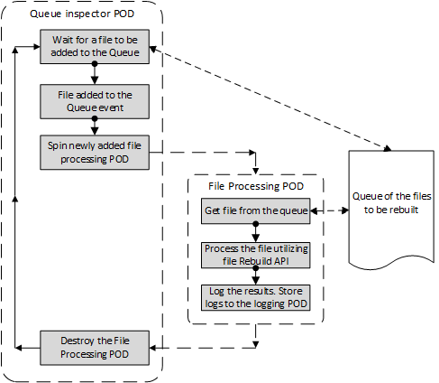

# GW Rebuild engine as a target system

The following is based on AMA meeting recording 03/09/2020  
https://zoom.us/rec/share/Sk5w_ipZM52YHSK-Y3yVIvwdnkg542cbfI_X4D83zyoSO-9m3hwTX3sMhG0bJRew.dU92Qqc8xpsxJAsd
Ask Doviana Tollaku (GW - Tech PM) for a passcode

## Basic steps

1. A file to be processed is added to the file queue
2. The Inspector POD gets the "File Added" event
3. The Inspector POD lunches a File Processing POD
4. The File Processing POD gets the file from the queue 
5. The File Processing POD rebuilds the file with GW Rebuild API
6. The File Processing POD logs the rebuild results/errors to the Logging POD
7. The Inspector POD destroys the File Processing POD as a potentially dangerous one 

## References

Rebuild Architecture
https://engineering.glasswallsolutions.com/docs/products/cloud-sdk/architecture/rebuild-architecture

The API utilization example
https://engineering.glasswallsolutions.com/docs/products/cloud-sdk/rebuild/rebuild-quickstart

