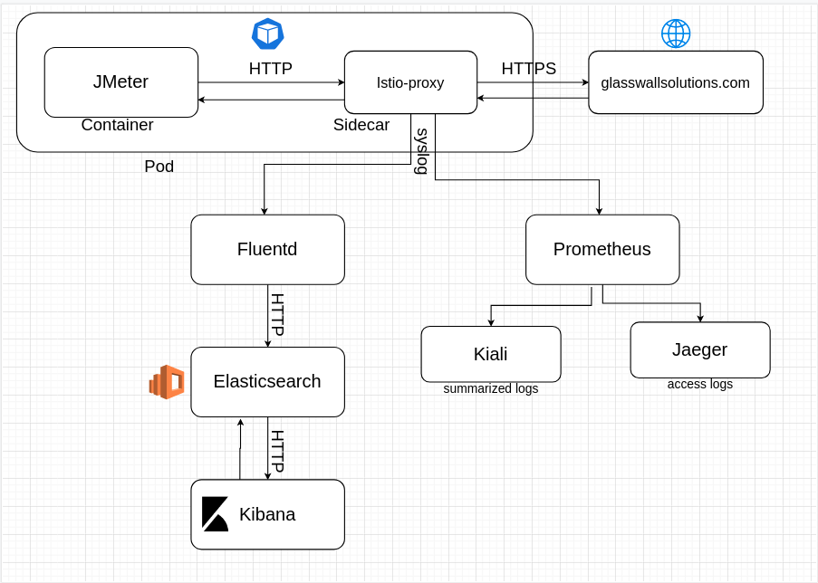
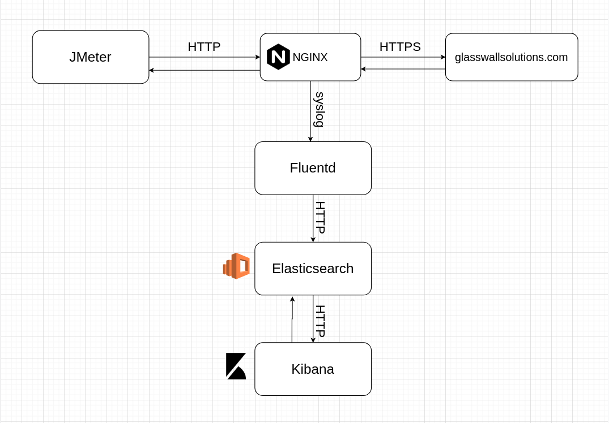

## Kibana conf: 
```sudo sysctl -w vm.max_map_count=262144```

``` 
echo "127.0.0.1       glasswallsolutions.local" >> /etc/hosts
docker-compose up -d
jmeter -n -t jmeter/glasswallsolutions.local.jmx -l ./jmeter/results/results.csv
```

```
test: 
http://glasswallsolutions.local

watch results on:
kibana: http://localhost:5601
elasticsearch: http://localhost:9200
```



