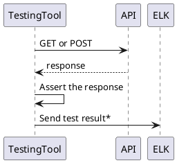

## Introduction
This page describe the concept of testing an API endpoint.
### Testing an API endpoint

*See [test result](#test-result)
## Validation logic
The Testing Tool must assert:
* the http status code
* one to several test logic

## Test Result object
The test result is sent to ELK. It is a JSON object that contains the following data:
```
{
    "testId": "string",                 // UUID. This is a unique identifier across all tests. 
    "start": "integer",                 // Test start time in UTC format
    "end": integer,                     // Test end time test in UTC format
    "testDuration": number,             // The duration of the test in microseconds
    "testScenarionName": "string",      // The name of the scenario 
    "testScenarionId": "string",        // The id of the scenario
    "testStepNo": integer,              // The number of the test step
    "testStepName": "string",           // The name of the test step
    "testDocUrl": "string",             // The URL of the scenario documentation
    "result": "string",                 // PASSED, FAILED or UNKNOWN
    "error": "string",                  // The error code defined by the test scenario if the result is FAILED or UNKNOWN. For Rest API Testing, this is  the HTTP Status Code.
    "errorMessage": "string",           // The error message or stacktrace received from the server
}
```
Above schema can be extended depending on the target API. For example, the Test Result of testing the Rebuild API should contain additional information, such as:
- Request Content Length
- Response Content Length
- GW API version
- GW Metrics
## Performance Metrics
List of performance metrics that can be generated by using the JSON Test Result:
- Number of test
- Number of successful/failed test
- Number of concurrent test
