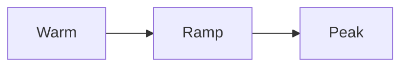

# Quick Start 
Running testing with the following phases and scenario:
## Phase

- Warming up 
    - Arrival rate of 2 for 60 seconds
- Ramping up
    - Arrival rate of 2 to 5 for 300 seconds
- Peak
    - Arrival rate of 5 for 600 seconds
## Scenario
Each virtual user will do the following:
- Open https://glasswallsolutions.com/technology
- Open https://glasswallsolutions.com/products
- Open https://glasswallsolutions.com/pricing
- Open https://glasswallsolutions.com/resources
- Open https://glasswallsolutions.com/company
## Install minikube
```
    brew install minikube
```
## Start minikube
```
    minikube start --driver=virtualbox
```
## Deploy artillery
```
    kubectl apply -f artillery.yaml
```
