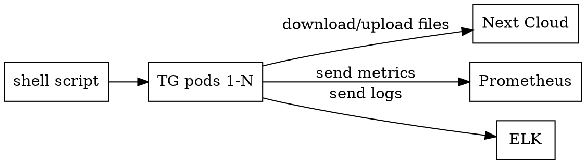

# Generate traffic on Next Cloud website

## Install next cloud

```
kubectl create ns nextcloud
helm upgrade --install nextcloud stable/nextcloud \
  --namespace nextcloud \
  --values nextcloud.values.yml
```

## Generate traffic using docker-compose. Next cloud is exposed on port 9090

```
docker-compose up --build
```

## Generate traffic using k8s

```
kubectl apply -f traffic_generator.yaml
```

### The pod sends metrics to prometheus and logs to ELK [TBD]



