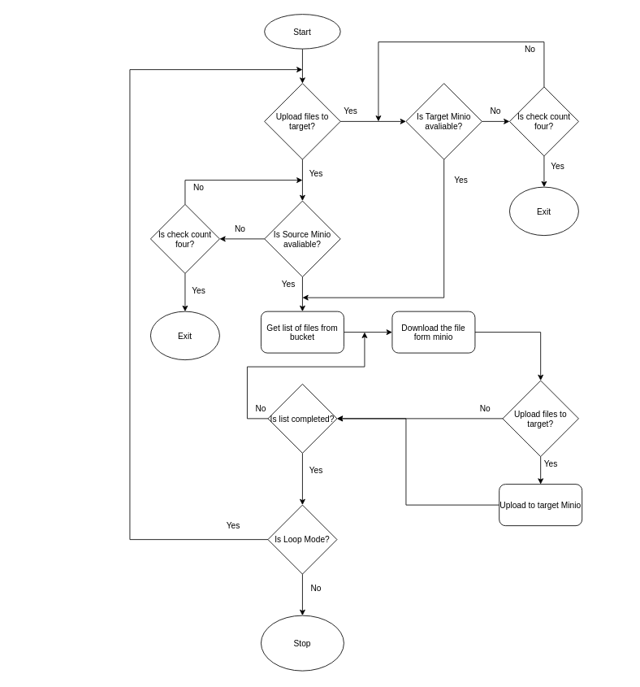

# Target Minio

The application written in python will make use of boto3 library to download the content of the minio bucket. If the environment variable `UPLOAD_TO_TARGET: True` is provided then the script will upload the files that are downloaded from one minio to the another minio.

You can use the following diagram to check the execution flow.

The application run in two mode. One Job mode in which the application will start once, loop through the files in bucket and download them. If `UPLOAD_TO_TARGET: True` is provided through the environment variable, it will also upload the downloaded files to the target minio.

As for the another mode, the application run on loop mode. Appliction will run in async loop untill it is keyboard inturrept. While running in this mode, application will download files continusly from the minio be even if it present in the filesystem and also will upload the files to the target minio if mentioned

## Starting The application

You can run the application in docker and in kubernetes as jobs.

## For Docker

`docker-compose up -d`

Note:

    While running in docker-compose mode, if you want to mount the /files directory to which the downloaded files are stored, you will have to run the docker with root user. If not, the container will not be able to write the the mounted directory and application will exit.

## For Kubernetes envrionment

`kubectl apply -f miniotrafic.yaml`
