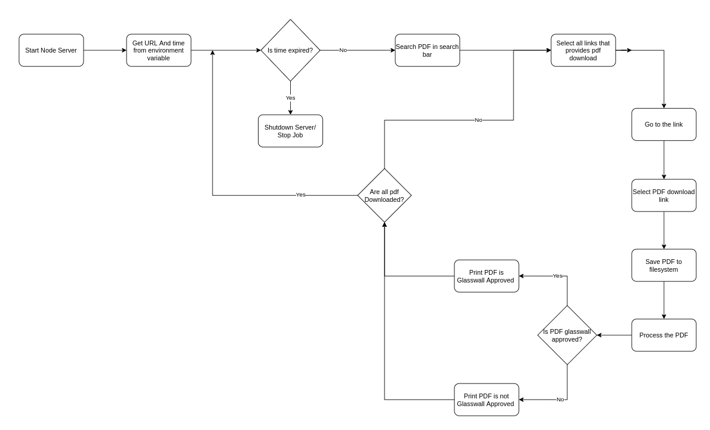

## Node Script For traffic Generation.

This the the application that generates the traffic against the URL [gov.uk](https://www.gov.uk) and glasswall proxied URL [gov.uk.glasswall-icap.com](https://www.gov.uk.glasswall-icap.com).

The flow diagram of the given script will be as follow.



In this application, if it is running in docker you will provide the environment variable URL with the url to be tested, in this case [gov.uk](https://www.gov.uk) or [gov.uk.glasswall-icap.com](https://www.gov.uk.glasswall-icap.com). Container will start the node script that will have a functionality that is defined as in above diagram. It it is to be running in the server environment. please export the variable by either adding it to .bashrc or by executing following command in console.
```
export URL="https://www.gov.uk.glasswall-icap.com"
```

Also if the application is to be deployed in the kubernetes engine, please apply the manifest file [jobmanifest.yaml](./jobmanifest.yaml) to create the kubernetes job.