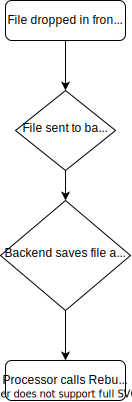

# File Drop Traffic Generator

This purpose of this project is to have a way of automating and simulating user interaction with the Rebuild API. In this project, you go into the frontend and upload files. Each file becomes a [Kubernetes Job](https://kubernetes.io/docs/concepts/workloads/controllers/job/) and is sent to the Rebuild API. Want to simulate 50 calls to the API? Drop 50 files into the frontend!

## How it works



### Frontend component

The frontend is a React app that presents a user with a file box to input files.

When the user drops files in the frontend, they are sent to the backend.

### Backend component

The backend is a Python web server.

When the backend receives files from the frontend, it saves each file into its file system and makes a call to the Kubernetes API to schedule a job that runs the processor for that file.

### Processor component

The processor is a Python script.

The script starts by downloading a file from the backend. Then, it sends that file to the Rebuild API.

### Detailed flow

It all starts with the frontend. Once a user drops files there, an HTTP POST request is sent to `/backend/files`. Because we have an NGINX ingress deployed, this request is routed to the backend service, which, in turn routes the request to the backend pod.

```yaml
rules:
  - http:
      paths:
        - path: /backend
          backend:
            serviceName: file-drop-traffic-generator-backend
            servicePort: 5000
        - path: /
          backend:
            serviceName: file-drop-traffic-generator-frontend
            servicePort: 80
```

Once the backend receives the filed in `/backend/files`, it gives each file a unique name via a Python method.

```python
file_identifier = f"file-drop-{uuid.uuid1()}"
```

Then, it saves the file to `/usr/src/app/backend/static` on its file system. At that point it schedules a Kubernetes Job by querying the Kubernetes API. The pod in the job runs a single container, the processor.

The processor downloads the file from the backend by sending an HTTP GET request to the backend service at `/backend/static/:file_identifier`. Once the processor has the file, it sends it to the Rebuild API authenticating with the API token provided in the installation.

## Installation

For purpose of installation, this project uses a [Helm Chart](https://helm.sh/).

See [installation instructions](./chart/README.md).
